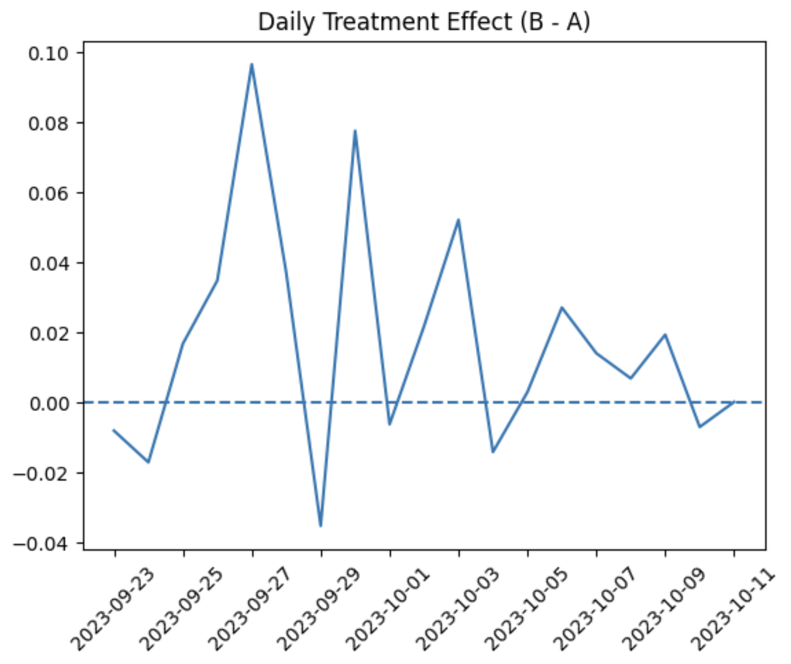
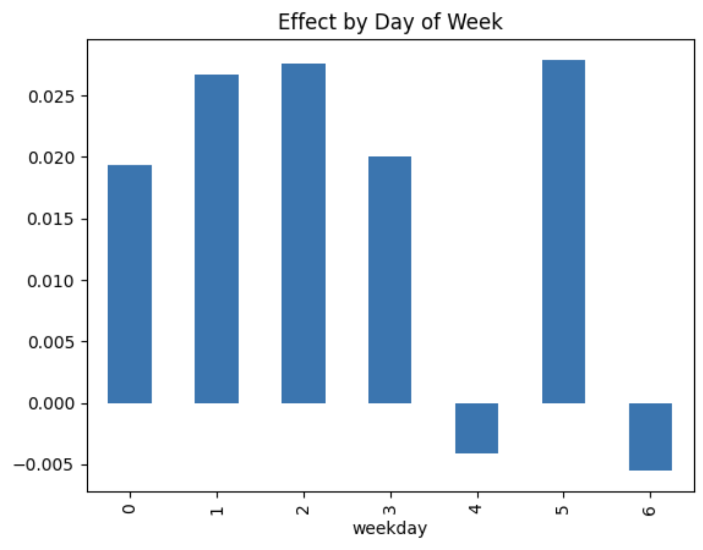

# Large-Scale A/B Testing & Experimentation Analysis

**Comprehensive statistical analysis** of a large-scale A/B test to evaluate the impact of a new product variant on conversion rate and revenue.

## 📋 Project Overview

Analyzed a real e-commerce A/B experiment (892K sessions, 887K unique users).

## 🎯 Key Results

- **Conversion Rate**: +0.02 p.p. (0.48% → 0.50%)
- **Bayesian Probability**: 88.85% that B is better
- **Revenue Uplift** (Bootstrap 10k): **+$0.0166** (97.8% prob.)

## 📈 Treatment Effect Dynamics

**Daily Treatment Effect (B - A)**

**Effect by Day of Week**

## 💡 Recommendation

**Launch Variant B** — positive revenue effect outweighs statistical uncertainty.

## 🛠️ Stack
Python • pandas • statsmodels • Matplotlib • Jupyter
